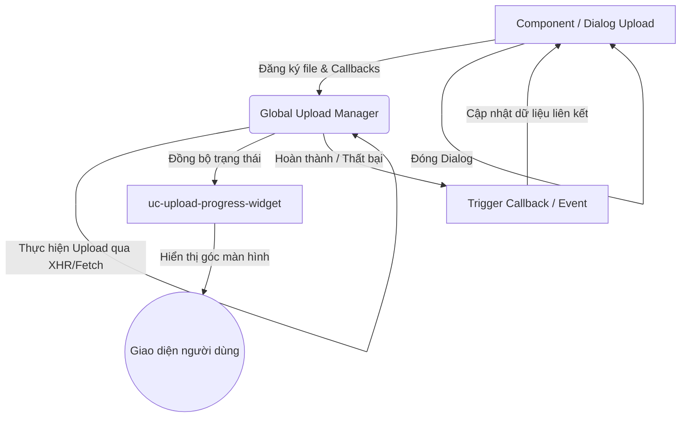

# Kế hoạch cải tiến: Upload file chạy ngầm & Đóng Dialog không bị chặn (Non-blocking Background Upload)

> [!NOTE]
> Tài liệu này phác thảo kế hoạch thiết kế và triển khai giải pháp upload file (video, bài giảng PPT/PDF, hình ảnh) chạy dưới nền (background). Người dùng có thể đóng dialog upload ngay lập tức để tiếp tục thực hiện các tác vụ khác trong hệ thống LMS mà không cần phải chờ đợi quá trình upload kết thúc. Quá trình upload sẽ được quản lý tập trung và hiển thị trực quan thông qua một widget tiến trình nổi trên màn hình.

---

## 1. Kiến trúc Giải pháp (Architecture)

Giải pháp bao gồm 3 phần chính phối hợp với nhau:



### 1.1. Bộ Quản Lý Upload Tập Trung (`Global Upload Manager`)
Được lưu dưới dạng một đối tượng Reactive toàn cục (ví dụ: `window.UploadManager` hoặc cung cấp qua `provide/inject` từ `Global.vue`).
- **Nhiệm vụ:**
  - Nhận hàng đợi các file cần upload.
  - Quản lý trạng thái từng tác vụ: `id`, `fileName`, `progress`, `status` (`'pending' | 'uploading' | 'success' | 'error'`), `xhr` (để hỗ trợ hủy tải lên).
  - Tự động thực hiện upload lần lượt hoặc song song theo lô.
  - Hỗ trợ cơ chế retry khi gặp lỗi mạng.
  - Bắn ra các callback/event khi quá trình upload hoàn tất để cập nhật dữ liệu ở component tương ứng.

### 1.2. Widget Tiến Trình Nổi (`uc-upload-progress-widget`)
Được nhúng trực tiếp vào component gốc `<Global.vue>` để luôn hiển thị xuyên suốt các module.
- **Giao diện & Chức năng:**
  - Nằm ở góc dưới cùng bên phải màn hình (giống như widget upload của Google Drive hoặc Gmail).
  - **Thu gọn (Collapse):** Chỉ hiện tiêu đề nhỏ gọn và tổng số file đang tải (Ví dụ: `Đang tải lên 2 file... (65%)`).
  - **Mở rộng (Expand):** Xem danh sách chi tiết các file. Mỗi dòng hiển thị:
    - Tên file & dung lượng.
    - Thanh tiến trình (`v-progress-linear`) và phần trăm thực tế.
    - Biểu tượng trạng thái (Đang xoay, dấu tích xanh hoàn thành, chấm đỏ báo lỗi).
    - Nút hành động: Hủy (`Cancel`), Thử lại (`Retry`), hoặc Xóa dòng khỏi danh sách sau khi đã upload thành công.

### 1.3. Cải tiến Luồng Giao Tiếp của Dialogs
- Khi người dùng chọn file và nhấn "Lưu/Upload":
  1. Component tạo tác vụ upload mới và đăng ký vào `Global Upload Manager`.
  2. Dialog đóng lại ngay lập tức.
  3. Khi upload hoàn tất, `Global Upload Manager` sẽ tự động thực hiện cập nhật API để lưu liên kết file vào cơ sở dữ liệu (ví dụ: gán video ID cho bài học hoặc bài tập).

---

## 2. Kế hoạch Triển khai Chi tiết

### Bước 1: Xây dựng Lớp quản lý `UploadManager`
Tạo file helper lưu trữ trạng thái reactive. Chúng ta sử dụng `Vue.observable` (đối với Vue 2) hoặc `reactive` (đối với Vue 3) để widget tiến trình có thể tự động lắng nghe và cập nhật giao diện.

```javascript
// imports/upload-manager.js
import Vue from 'vue';

const state = Vue.observable({
  tasks: [] // Danh sách tác vụ upload
});

export const UploadManager = {
  get tasks() {
    return state.tasks;
  },

  // Thêm file vào hàng đợi
  addUploadTask({ file, uploadUrl, headers = {}, bodyBuilder, onComplete, onError }) {
    const taskId = 'task_' + Date.now() + '_' + Math.random().toString(36).substr(2, 9);
    const xhr = new XMLHttpRequest();

    const task = {
      id: taskId,
      fileName: file.name,
      fileSize: file.size,
      progress: 0,
      status: 'pending',
      xhr: xhr
    };

    state.tasks.push(task);

    // Bắt đầu upload
    this.startUpload(task, file, uploadUrl, headers, bodyBuilder, onComplete, onError);
    return taskId;
  },

  startUpload(task, file, uploadUrl, headers, bodyBuilder, onComplete, onError) {
    task.status = 'uploading';
    const xhr = task.xhr;

    xhr.open('POST', uploadUrl, true);
    
    // Set headers
    Object.keys(headers).forEach(key => {
      xhr.setRequestHeader(key, headers[key]);
    });

    // Theo dõi tiến trình tải lên
    xhr.upload.onprogress = (event) => {
      if (event.lengthComputable) {
        task.progress = Math.round((event.loaded / event.total) * 100);
      }
    };

    xhr.onload = () => {
      if (xhr.status >= 200 && xhr.status < 300) {
        task.status = 'success';
        task.progress = 100;
        let responseData = {};
        try {
          responseData = JSON.parse(xhr.responseText);
        } catch (e) {
          responseData = xhr.responseText;
        }
        if (onComplete) onComplete(responseData);
      } else {
        this.handleError(task, onError);
      }
    };

    xhr.onerror = () => {
      this.handleError(task, onError);
    };

    // Chuẩn bị dữ liệu body (FormData hoặc Binary tùy API)
    const body = bodyBuilder ? bodyBuilder(file) : file;
    xhr.send(body);
  },

  handleError(task, onError) {
    task.status = 'error';
    if (onError) onError();
  },

  cancelTask(taskId) {
    const task = state.tasks.find(t => t.id === taskId);
    if (task) {
      if (task.status === 'uploading' && task.xhr) {
        task.xhr.abort();
      }
      task.status = 'cancelled';
      this.removeTask(taskId);
    }
  },

  removeTask(taskId) {
    state.tasks = state.tasks.filter(t => t.id !== taskId);
  }
};
```

### Bước 2: Thiết kế Widget `<uc-upload-progress-widget>`
Tạo UI nổi cố định (`position: fixed`) nằm ở góc dưới màn hình.

```vue
<!-- components/uc-upload-progress-widget.vue -->
<template>
  <v-card 
    v-if="tasks.length > 0" 
    class="upload-progress-widget shadow-lg"
    :width="isCollapsed ? 300 : 400"
    style="position: fixed; bottom: 16px; right: 16px; z-index: 9999; border-radius: 8px;"
    elevation="4"
  >
    <!-- Header của Widget -->
    <v-card-title class="bg-primary text-white d-flex align-center py-2 px-3 justify-space-between">
      <div class="text-subtitle-2 font-weight-bold d-flex align-center ga-2">
        <v-icon size="small">mdi-cloud-upload</v-icon>
        <span>{{ headerText }}</span>
      </div>
      <div class="d-flex align-center ga-1">
        <v-btn icon size="x-small" variant="text" color="white" @click="isCollapsed = !isCollapsed">
          <v-icon>{{ isCollapsed ? 'mdi-chevron-up' : 'mdi-chevron-down' }}</v-icon>
        </v-btn>
      </div>
    </v-card-title>

    <!-- Danh sách chi tiết (chỉ hiển thị khi không thu gọn) -->
    <v-slide-y-transition>
      <v-card-text v-if="!isCollapsed" class="pa-2 overflow-y-auto" style="max-height: 300px;">
        <div v-for="task in tasks" :key="task.id" class="border-b py-2 px-1">
          <div class="d-flex align-center justify-space-between mb-1 ga-2">
            <div class="text-caption text-truncate font-weight-medium" style="max-width: 70%;">
              {{ task.fileName }}
            </div>
            <div class="text-caption text-medium-emphasis">
              <span v-if="task.status === 'uploading'">{{ task.progress }}%</span>
              <span v-else-if="task.status === 'success'" class="text-success font-weight-bold">Hoàn thành</span>
              <span v-else-if="task.status === 'error'" class="text-error font-weight-bold">Lỗi</span>
            </div>
          </div>

          <!-- Thanh tiến trình -->
          <v-progress-linear
            :value="task.progress"
            height="6"
            rounded
            :color="getProgressColor(task.status)"
            :indeterminate="task.status === 'pending'"
            class="mb-1"
          />

          <!-- Action buttons cho từng file -->
          <div class="d-flex justify-end ga-2">
            <v-btn 
              v-if="task.status === 'uploading'" 
              size="x-small" 
              variant="text" 
              color="error" 
              @click="cancelUpload(task.id)"
            >
              Hủy
            </v-btn>
            <v-btn 
              v-if="task.status === 'success' || task.status === 'error'" 
              size="x-small" 
              variant="text" 
              color="grey" 
              @click="removeTask(task.id)"
            >
              Đóng
            </v-btn>
          </div>
        </div>
      </v-card-text>
    </v-slide-y-transition>
  </v-card>
</template>

<script>
import { UploadManager } from '../imports/upload-manager';

export default {
  name: 'uc-upload-progress-widget',
  data() {
    return {
      isCollapsed: false,
    };
  },
  computed: {
    tasks() {
      return UploadManager.tasks;
    },
    headerText() {
      const activeCount = this.tasks.filter(t => t.status === 'uploading' || t.status === 'pending').length;
      if (activeCount > 0) {
        return `Đang tải lên ${activeCount} file...`;
      }
      return 'Tải lên hoàn tất';
    }
  },
  methods: {
    getProgressColor(status) {
      if (status === 'success') return 'success';
      if (status === 'error') return 'error';
      return 'primary';
    },
    cancelUpload(taskId) {
      UploadManager.cancelTask(taskId);
    },
    removeTask(taskId) {
      UploadManager.removeTask(taskId);
    }
  }
};
</script>
```

### Bước 3: Đăng ký Widget vào `<Global.vue>`
Tích hợp widget vào giao diện chung tại [Global.vue](file:///run/media/luan/DATA/_win/fui-lms/lhbs-lms/components/Global.vue) để nó có thể hiển thị đè lên tất cả các trang/iframe.

```diff
  <template>
      <div>
          <GlobalLoading />
          <GlobalApiErrorDialog />
          <GlobalStaleDataBanner />
          <GlobalUiSnackbar ref="snackbarRef" />
          <GlobalIframeWindow ref="iframeWin" />
          <GlobalConfirmDialog ref="confirmRef" />
+         <uc-upload-progress-widget />
          <uc-system-toolbar v-if="!isInIframe" />
```

### Bước 4: Refactor luồng upload tại các component nghiệp vụ (Ví dụ: `uc-lesson-properties.vue`)
Chuyển đổi từ gọi API chặn màn hình (`loadingPage.text = 'Đang upload...'`) sang đăng ký task ngầm thông qua `UploadManager`.

**Trước khi cải tiến:**
```javascript
this.loadingPage.text = 'Đang upload...';
const res = await fetch('https://file.lhbs.vn/lms/upload/FileData', { ... });
// Đợi chờ đồng bộ...
```

**Sau khi cải tiến:**
```javascript
// Đăng ký upload chạy ngầm và định nghĩa callbacks
UploadManager.addUploadTask({
  file: selectedFile,
  uploadUrl: 'https://file.lhbs.vn/lms/upload/FileData',
  bodyBuilder: (file) => {
    const formData = new FormData();
    formData.append('File', file);
    return formData;
  },
  onComplete: async (uploadResponse) => {
    // 1. Nhận thông tin file sau khi upload thành công
    const fileId = uploadResponse.Files[0].FILE_ID;
    
    // 2. Tự động gọi API lưu trữ/liên kết file đó vào bài học ở database
    await fetchPromise('lesson/save-file-link', {
      LessonID: this.LessonID,
      FileID: fileId
    }, { cache: false });

    // 3. Thông báo cho người dùng
    this.snackbarRef.value.showSnackbar({
      message: `Tải lên ${selectedFile.name} thành công và đã được áp dụng vào bài học.`,
      color: 'success'
    });
    
    // 4. Reload danh sách tài liệu trong component
    this.getData();
  },
  onError: () => {
    this.snackbarRef.value.showSnackbar({
      message: `Tải lên file ${selectedFile.name} thất bại.`,
      color: 'error'
    });
  }
});

// Đóng dialog ngay lập tức
this.isUploadDialogOpen = false;
```

---

## 3. Lợi ích mang lại
- **Trải nghiệm người dùng tốt hơn:** Không còn cảm giác "đơ" hoặc "bị động" phải chờ màn hình loading kết thúc, đặc biệt hữu ích khi tải các file video bài giảng lên đến hàng trăm Megabytes.
- **Tận dụng tối đa thời gian:** Người dùng có thể tiếp tục soạn bài giảng khác, tạo câu hỏi trắc nghiệm, cấu hình lớp học trong lúc hệ thống tự động tải file ngầm.
- **Kiểm soát trực quan:** Người dùng luôn theo dõi được trạng thái tải lên của từng file thông qua widget nhỏ gọn ở góc màn hình, có thể hủy hoặc tải lại tùy ý.
